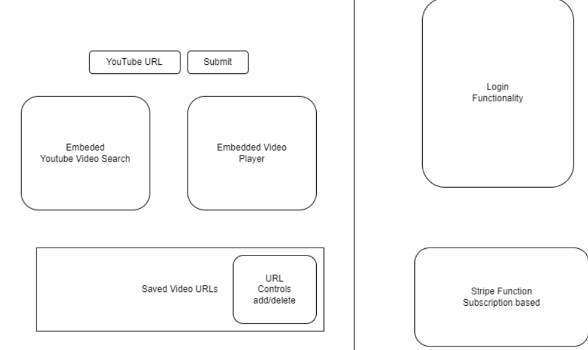

# Project-2

# VideoLingo

* This is an application used to translate Youtube videos from English to Spanish.

# User Stories

* As a user, I want to be able to search for Youtube videos from the application.

* As a user I would like to have videos that interest me translated to Spanish

## Acceptance Criteria

## GitHub Repository
https://github.com/christopherflores9312/VideoLingo.git

## Hosted

## Usage / Features

## Main Components:
Node.js  
React  
Materialize  
MongoDB  
GraphQL  
Express

## Designed and created by:
Christopher Flores 
Dylan Kazunaga 
Bill Hamilton