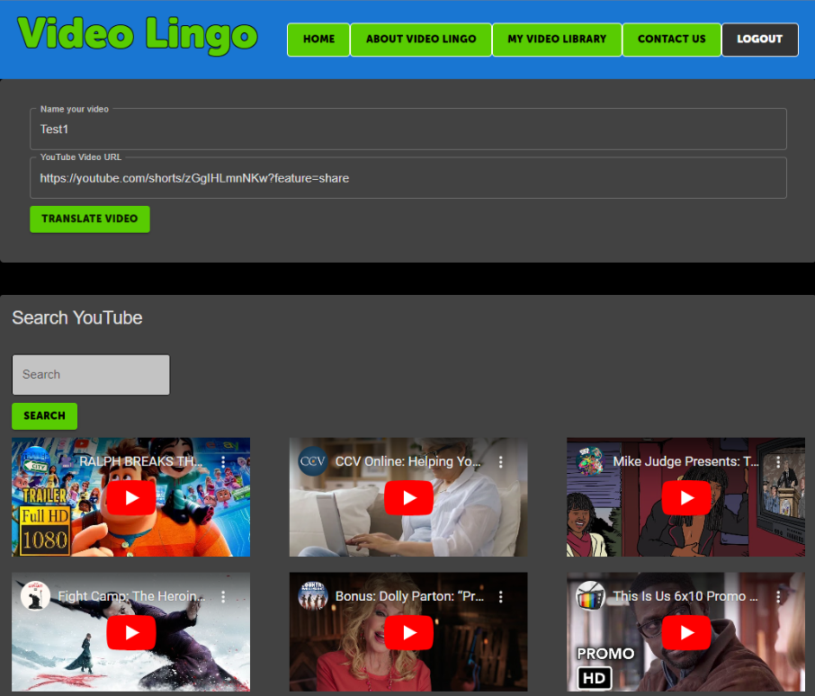

# Project-Final

# VideoLingo

* This is an application used to translate Youtube videos from English to Spanish.

# User Stories

* As a user, I want to be able to translate videos from English into Spanish,  so that I can watch them in Spanish 

* As a user, I would like to be able download videos I translated to view later.

## Acceptance Criteria
* Its done when user can submit a YouTube video url in the interface and translate the video to Spanish.

* Its done when the logged in user can view a history of videos they submitted for translation

* Its done when user can download or delete previously translated video 

## Installation

1. **Clone the Repository**: Clone this repository to your local machine using the command:
    git clone https://github.com/christopherflores9312/VideoLingo.git
2. **Navigate to the Project Directory**:

3. **Install Dependencies**: Install the required dependencies for both client and server using npm install

4. **Set Up Environment Variables**: Create `.env` files in both the client and server directories with the required environment variables.

5. **Start the Application**: Run the following commands to start the client and server:

// In the client directory
npm start

// In the server directory
node server.js

## Usage

1. **Sign Up / Log In**: Create an account or log in to access the video translation features.
2. **Translate Videos**: Search and paste a YouTube video url in the text to translate from English to Spanish.
3. **Download Videos**: Download translated videos to your local device.
4. **Contact Us**: Reach out to our support team through the Contact Us page.

## GitHub Repository
https://github.com/christopherflores9312/VideoLingo.git

## Hosted
Heroku
https://videolingo-4a86a4dabd29.herokuapp.com/

## Usage / Features

**Video Translation**: Translate YouTube videos from English to Spanish with just a few clicks.
**Video Library**: Manage and access all your translated videos in one place.
**User Authentication**: Secure login and signup process to protect user data.
**Intuitive Interface**: Easy-to-use interface that allows for efficient video processing and management.
**Download Capability**: Download translated videos directly to your device.
**Contact Us Page**: Get in touch with our support team through the Contact Us page.

## Main Components:
* Node.js 
* React 
* Materialize
* MongoDB
* GraphQL
* Express
* Microsoft Speech Studio
* AWS Data Services

## Designed and created by:
Christopher Flores 
Dylan Kazunaga 
Bill Hamilton